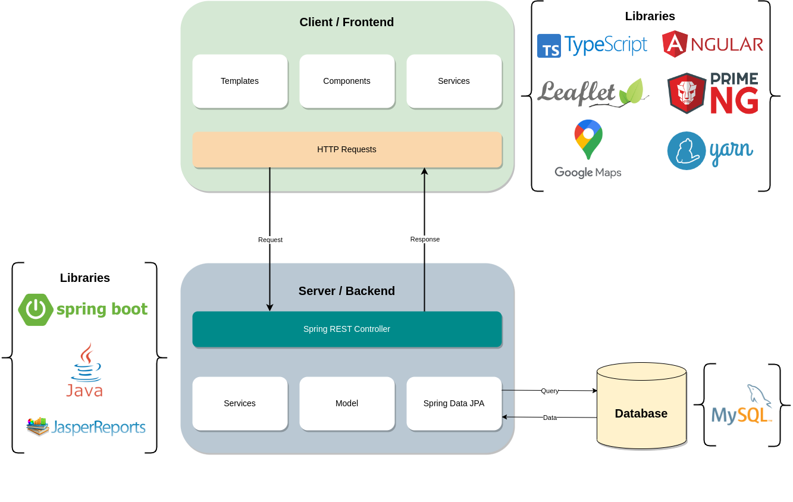

# Requisitos do sistema

## Ambiente

- Java Development Kit (JDK) 17: É necessário para executar o backend Java do software.

- Spring Framework 2.7.2: Framework Java necessário para o desenvolvimento da aplicação.

- Node.js 14 ou superior: Necessário para o gerenciamento de pacotes e execução do frontend Angular.

- Angular CLI 14: Ferramenta de linha de comando para criar, desenvolver e manter aplicações Angular.

<figure markdown>
  { width="900" }
  <figcaption>Arquitetura do sistema</figcaption>
</figure>

<figure markdown>
  { width="900" }
  <figcaption>Configuração dos servidores</figcaption>
</figure>

<figure markdown>
  { width="500" }
  <figcaption>Arquitetura DevOps do sistema</figcaption>
</figure>

